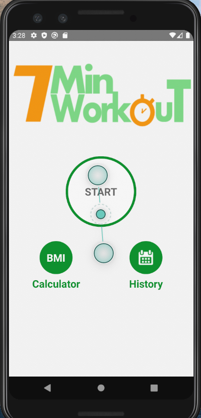
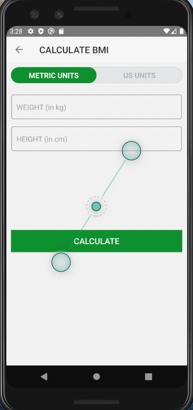
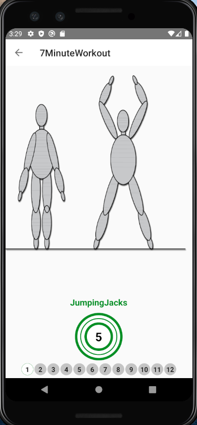

# 7-Minute-Workout-App
This is a 7 minute workout android app that I created

The front page of the app-

When the BMI button is clicked-

An example exercise page (after clicking the start button) -

What I learned-

- using timers
- using text to speech function
- adding a media player to play sounds
- Recyclerview
- SQLITE to store data in a local database
